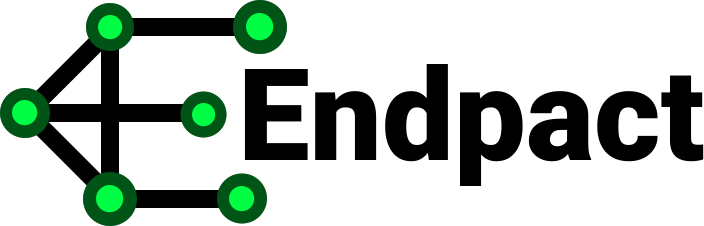

<p align="center">
    <a href="https://github.com/MadL0rd/Endpact">
        
    </a>
    <a href="https://zod.dev">
        
    </a>
    <a href="https://www.npmjs.com/package/endpact">
        
    </a>
    <a href="./LICENSE">
        
    </a>
</p>

<p align="center">
  
</p>
<p align="center">
  A TypeScript library for strict API contract definitions, built on top of <a href="https://github.com/colinhacks/zod">Zod</a> and Fetch API.
</p>

## Features

- 🔒 Strict API contracts with Zod validation
- 🌐 Works with Fetch API (Node.js ≥18 and browsers)
- 🎯 Advanced TypeScript generics for great DX
- 🧩 Richly typed call results:
    - ✅ Success (default `ok` response schema)
    - ✅ Success (alternative status codes with their own schemas)
    - ⚠️ Expected errors (4xx / 5xx with schema)
    - ❌ Failure modes (timeouts, invalid data, unexpected status codes)
- 🕵️ Built-in sensitive data masking in logs
- 🛠 Customizable logging and retry strategies (coming soon)
- 📦 Tiny and tree-shakable

## Installation

```bash
npm install endpact zod
# or
yarn add endpact zod
# or
pnpm add endpact zod
```

## Quick Start

```
import { endpact } from "endpact"
import { z } from "zod"

/**
 * 1) Define endpoint schema
 */

const itemSchema = z.object({
    id: z.string(),
    name: z.string(),
}),
export const GetItemsEndpoint = endpact.makeEndpoint.withBuildFunc({
  buildFunc: (data: { searchText: string }) => ({
    method: "GET" as const,
    path: "/api/items/",
    queryParams: {
      limit: "10",
      offset: "0",
      search: data.searchText,
    },
    responses: {
      ok: itemSchema.array(),
      404: z.any().transform(() => [] as z.infer<typeof itemSchema>[]),
    },
  }),
  metadata: { authType: "queryParams" } as const,
})

/**
 * 2) Initialize service
 */
const api = new endpact.HttpApiService({
  baseUrl: "https://api.example.com",
  endpoints: {
    getItems: GetItemsEndpoint,
  },
  transform: (endpoint) => {
    endpoint.addBuildMiddlewareContentType("application/json")

    switch (endpoint.metadata.authType) {
      case "body":
        endpoint.addBuildMiddlewareCommonData({
          body: { token: "some-random-string" },
        })
        endpoint.addSensitiveData({
          request: { bodyKeyPaths: ["token"] },
        })
        break
      case "queryParams":
        endpoint.addBuildMiddlewareCommonData({
          queryParams: { token: "some-random-string" },
        })
        endpoint.addSensitiveData({
          request: { queryParams: ["token"] },
        })
        break
    }

    return endpoint
  },
  defaultRequestTimeoutMs: 20_000,
  logging: {
    name: "itemsApiService",
    logger: console,
  },
})

/**
 * 3) Call endpoint
 * Now it's auto-exposed as api.call.getItems({ searchText: 'some search string' })
 */
const result = await api.call.getItems({ searchText: "some search string" })

/**
 * 4) Handle typed result
 */
if (result.success) {
  console.log(result.data) // typed as { id: string; name: string }[]
} else if (result.errorType === "EXPECTED_ERROR") {
  console.error(result)

  // Example type hint in this branch:
  // const result: {
  //   success: false
  //   statusCode: 404
  //   statusText: string
  //   errorType: "EXPECTED_ERROR"
  //   data: never[]
  // }
}
```

## Roadmap

- [ ] Multipart/form-data support
- [ ] Advanced retry strategies (exponential backoff)
- [ ] Response `Content-Type` validation
- [ ] Advanced logging features (custom inspect for response objects)
    - [ ] Log level customization
    - [ ] Custom inspect result for response objects
- [ ] Documentation site (Astro + GitHub Pages)
- [ ] Examples & guides

## Contributing

Contributions, issues, and feature requests are welcome!  
Feel free to open an [issue](https://github.com/MadL0rd/Endpact/issues) or submit a PR.

## License

[Apache 2.0](./LICENSE) © 2025 MadL0rd
